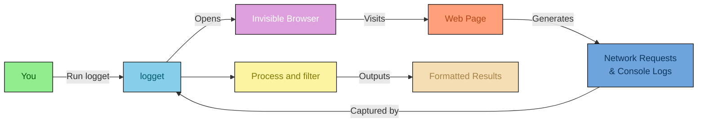
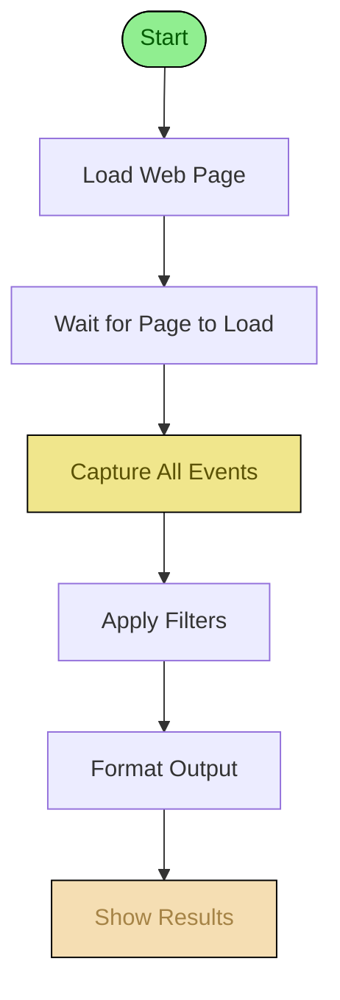
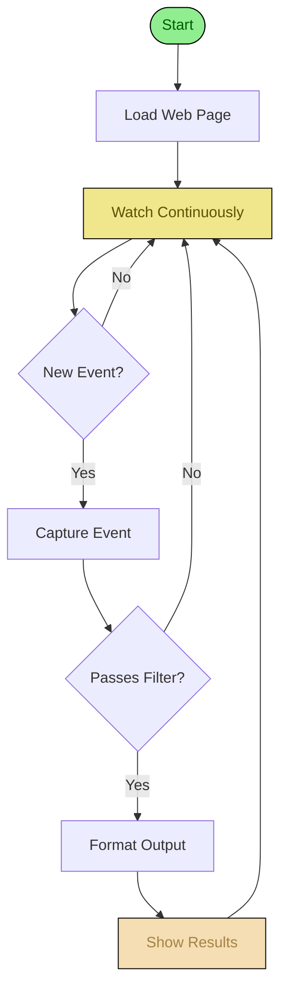

# How logget Works

This document explains how logget works from a conceptual perspective, helping you understand what happens when you use it.

## What is logget?

logget is a command-line tool that opens a web page in an invisible browser and captures everything that happens: network requests, console messages, and JavaScript errors. Think of it as a spy or observer that watches what a website does behind the scenes.

## The Big Picture

## Two Ways to Use logget

### Normal Mode - One-Time Capture

In normal mode, logget loads the page once, captures everything that happens, and then shows you the results.

**Use this when:** You want to see what happens when a page loads once.

### Follow Mode - Real-Time Streaming

In follow mode, logget continuously watches the page and shows you events as they happen in real-time.

**Use this when:** You want to monitor a page that updates dynamically or makes ongoing requests.

## Key Concepts

### Invisible Browser
logget uses a "headless" browser - a browser that runs without a visible window. This allows it to work on servers and in automated environments.

### Event-Driven
Everything logget captures is based on events: when a network request happens, when a console message appears, when an error occurs. logget listens to these events and records them.

### Non-Intrusive
logget doesn't modify the web page or interfere with its behavior. It simply observes and records what happens naturally.

### Flexible Output
The same captured data can be formatted in multiple ways, making it easy to use the results in different contexts (human reading, program processing, analysis tools).
